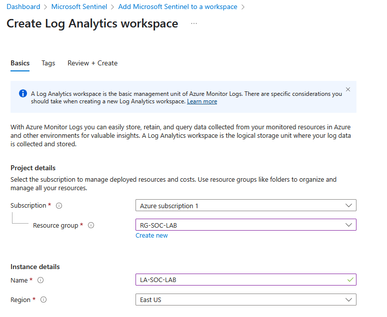
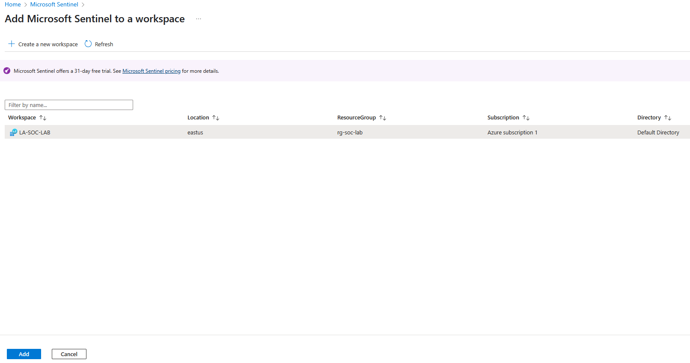
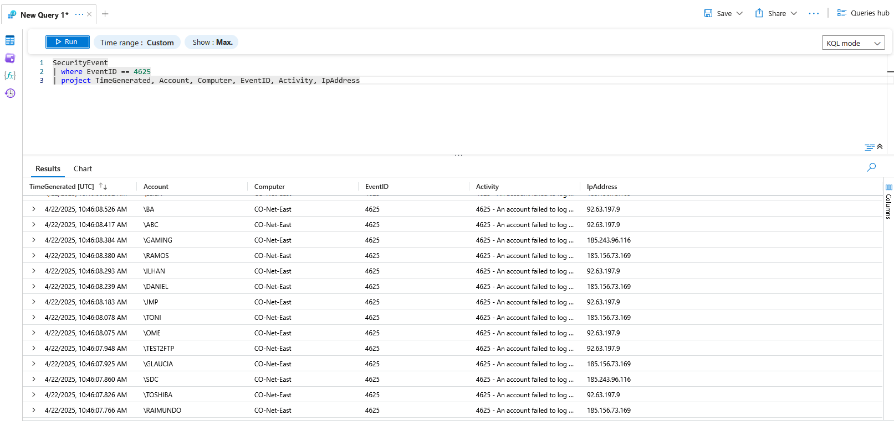
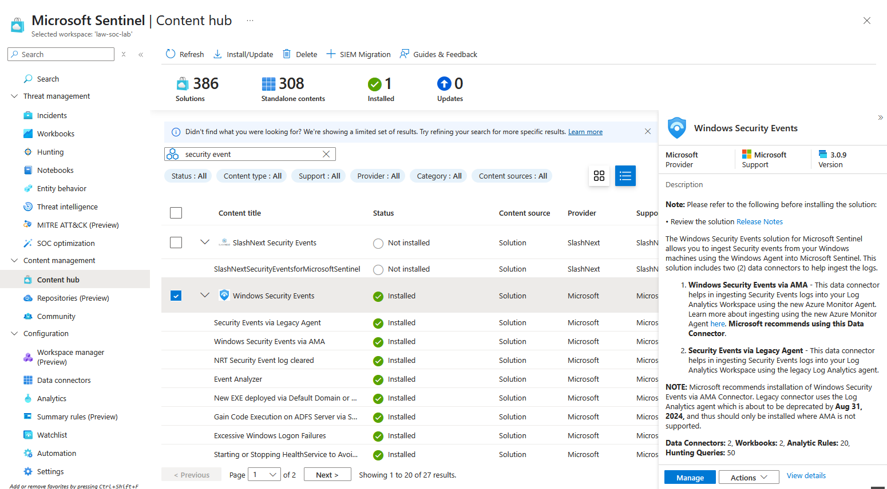
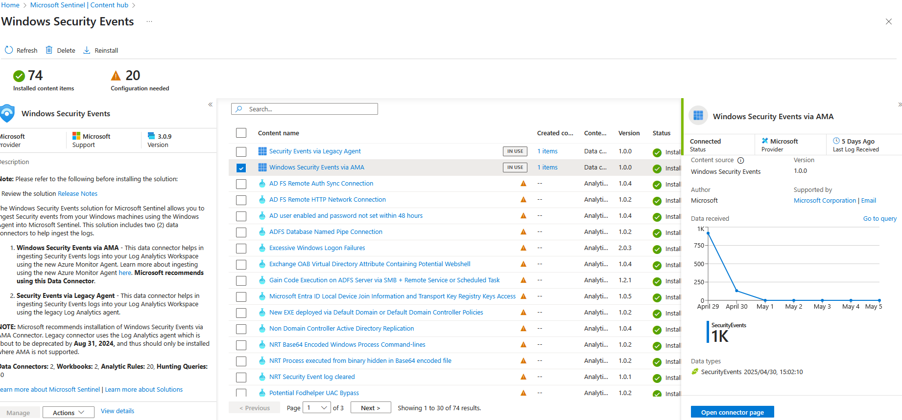
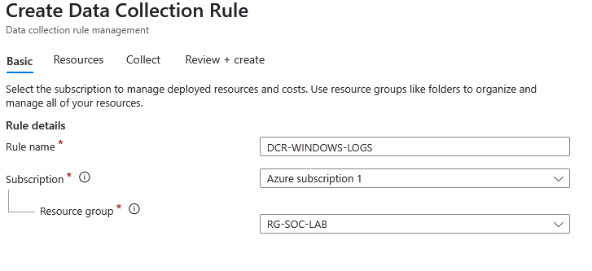
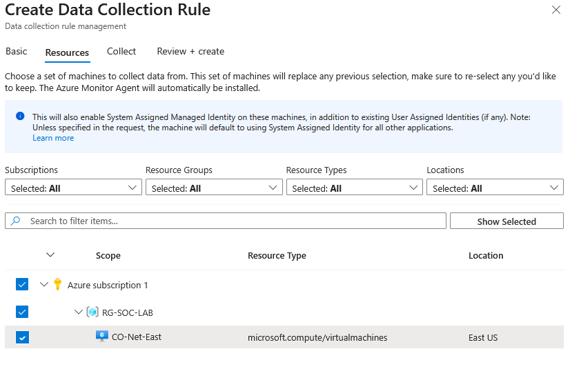

<h1 align="center">Azure-Honeypot</h1>

<h4 align="center">This project sets up a honeypot using an intentionally exposed Windows Virtual Machine (VM) hosted on Microsoft Azure. The goal is to attract unauthorized connection attempts, allowing us to monitor and analyze attacker behavior using Azure Sentinel.</h4>

---

<h2 align="center">📌 Project Overview</h2>

**The Azure-Honeypot demonstrates how cloud-based resources can be used for threat detection and monitoring. The honeypot is designed to:**
- Simulate a vulnerable Windows VM.
- Allow inbound connections from any IP.
- Log and analyze attack attempts via **Azure Sentinel**.
- Identify attacker IP addresses and estimate physical locations.

---

<h2 align="center">🛠️ Tools & Technologies</h2>

- **Azure Virtual Machine** (Windows OS)
- **Azure Sentinel** (SIEM for log analysis)
- **Azure Log Analytics workspaces** (log collection tool)

 
---
<h2 align="center">💻 Creating a Virtual Machine in Azure</h2>

***Firstly we are going to create a Windows 10 Virtual Machine in Azure that we are going to use to as our honeypot to lure bad actors trying to connect to the vm from remote locations.***

  

---

<h2 align="center">🔥 Disabling the Firewall in the Windows VM</h2>

***Next we are going to connect to the firewall using the "Remote Desktop Connection" app on Windows and the login details we made creating the VM. Then we are going to go into the Windows Firewall settings where we are going to turn off the Windows Firewall completely to allow any user to remotely connect to our VM. This will allow us to see speciific details about attackers trying to gain access.***

  

---

<h2 align="center">🏗️ Creating a Log Analytics Workspace</h2>

***Next we are going to create a Log Ananlytics Workspace to collect information useful to us from attackers trying to connect to the Virtual Machine***

  

***After that we can create a Microsoft Sentinel and connect the Log Analytics Workspace to it to have the ability to add watchlists and workbooks to be able to do more with the logs that we collect***

  

***When we created a Log Analytics Workspace and connected it to Sentinel we can create rules for our Log Analytics Workspace to filter out logs from bad actors trying to connect to our VM. Therefore we are going to look for Security events with the EventID = 4625 aswell as getting the Time of the incident, the user trying to login, the vm they are connection to, the activity and the attacker's Ip address***

  

---

<h2 align="center">🧩 Adding and Configuring Windows Security Events to Sentinel</h2>

***Next we are going to Install "Windows Security Events" to the content hub of our Microsoft Sentinel to be able to access our VM's security logs. When it is done we are going to click on "Manage" to configure it***

  

***After we installed Windows Secuirty Events we are going to click on the box next to "Windows Security Events via AMA" and clicking on "Open Connector Page" to create a new Data Collection Rule***

  

***We are going to give our Data Collection Rule a suitable name and connect it to our Resource Group where everything we are working with is connected***

  

***Under resources we are going to select the VM that is hosting our windows honeypot and after that it is going to allow Sentinel to collect Windows Security Logs from our Windows Honeypot***

  

---

<h2 align="center">🌐 Getting GeoIP information from Attackers</h2>

***Next we are going to use this .csv file that I got online that gives us information about where each IP adress is located to collect geographical information about the attackers trying to connect to our VM***

  

***After we downloaded the .csv file we are going to create a watchlist and upload the .csv in our Sentinel to match the attacker's IP adress with their physical location***

  

---

<h2 align="center">📊 Creating a Sentinel Workbook</h2>

***After creating our watchlist we can create a workbook to visualy show where the attackers are trying to connect from in a world map format using this code from the JSON file down below***

  

  

---

<h2 align="center">📍 Attack Map</h2>

***Finally we can see a map of where attackers are trying to connect from. The red circle refers to the location from where most of the login attempts are coming from and the small dark green dots are the locations that the least amount of people tried to login from***

  

<h2 align="center"> ⚠️ Please Note </h2>

I used a secure environment to conduct this project on leaving the Virtual Machine on for only 30 min to collect enough logs. **DISABLING YOUR FIREWALL ALLOWS ANYONE FROM ANYWHERE TO CONNECT TO YOUR MACHINE AND THEREFORE IT SHOULD ONLY BE DONE IN A SAVE ENVIRONMENT**

